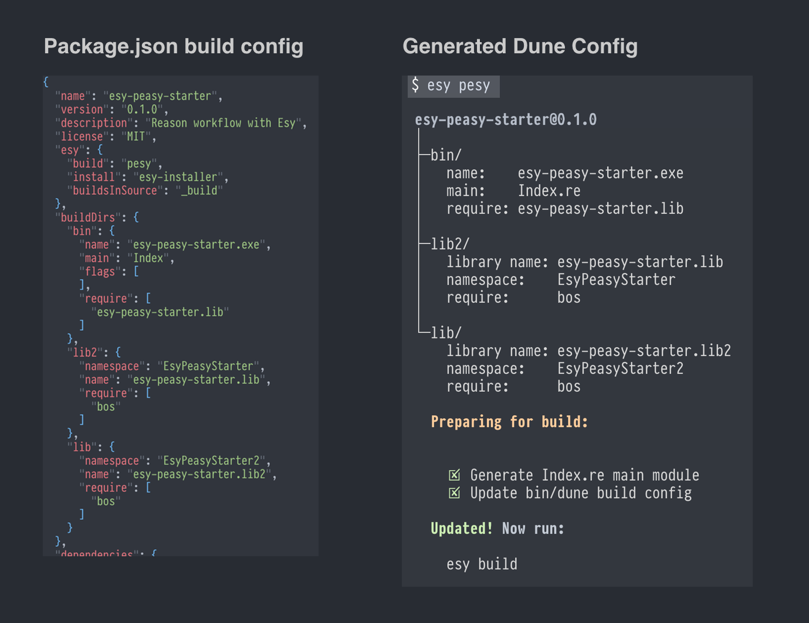
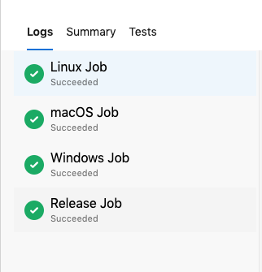
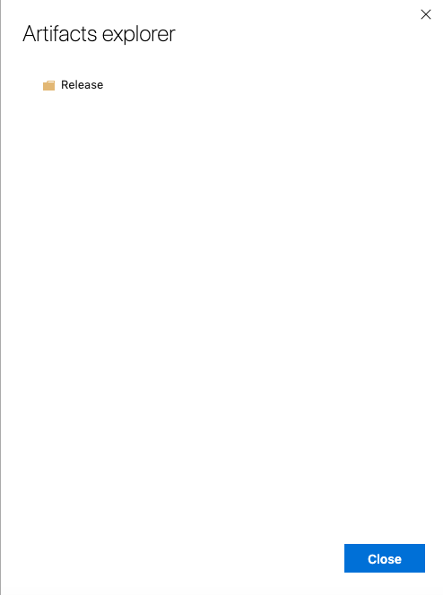
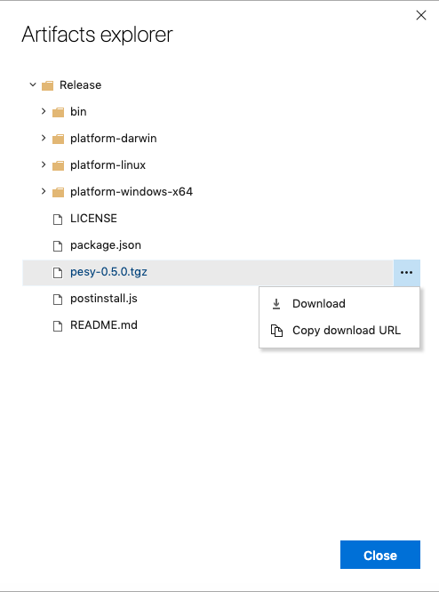
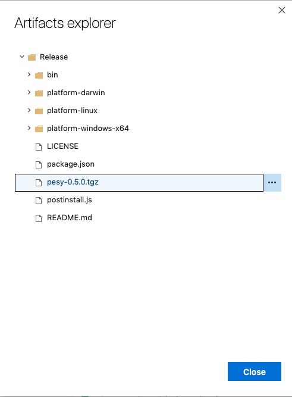

# pesy

[](https://dev.azure.com/pesy/pesy/_build/latest?definitionId=1&branchName=master)

- Use `package.json` to automatically configure libraries and executables built
  with Dune.



### Installation

```sh
npm install -g pesy
```

This installs a prebuilt binary on your system. For checksum verification - refer [these steps](#checksum-verification)

> Note: The new native rewrite of `pesy` has been published to `npm install -g pesy@next` and is undergoing alpha/beta testing.

### Create New Project:

`pesy` global command creates `esy` projects instantly inside of any directory.

```sh
cd my-project
pesy      # Hit enter to accept default name
```


This creates:

- `package.json` with useful dependencies/compilers.
- `.gitignore` and `README.md` with instructions for new contributors.
- `.circleci` continuous integration with cache configured for ultra-fast pull
    requests.
- `library/`, `executable/` and `test/` directory with starter modules.

The created project uses `pesy` in its build step. As always, run `esy pesy`
any time you update the build config in the `package.json`.


Once you've created a project, you normally only ever run `esy build` on the
command line. If you update your `package.json` `buildDirs` field, you will
need to run `esy pesy` which will update all the project build config based on
your `package.json` file changes. Then, you just run `esy build` as usual. You
only need to run `esy pesy` if you change your `package.json` file.

(Hopefully, this could be automatically done in the future so you only ever run
`esy build` as usual).

### Build `pesy` Project:

```sh
esy build
```

Your project's `esy.build` field is set to `pesy`, which will run `pesy` to
verify that all your build config is up to date before invoking the Dune build.
It will let you know if you need to run `esy pesy` to update your build config
from new changes to `package.json`.

### Update `pesy` Project:

```sh
esy pesy
```

If you change your `buildDirs` config in `package.json`, run this command to
update build configuration.


## Configuring:

Configure your `package.json`'s `buildDirs` field for multiple libraries and
executables.
`buildDirs.DirectoryName` means that a library or executable will be located at
`./DirectoryName`. The `buildDirs.DirectoryName.name` field determines the
public name of the library or executable. a `name` ending in `.exe` is
automatically configured as an executable, and a name of the form
`packageName.anything` is automatically configured to be a library with the
public name of `packageName.anything`.


```json
"buildDirs": {
  "MyLibrary": {
    "name": "packageNameMyLibrary",
    "namespace": "MyLibrary",
    "require": ["console.lib"]
  },
  "Tests": {
    "name": "Tests.exe",
    "description": "Runs all the tests natively",
    "flags": ["-linkall"],
    "require": ["console.lib", "packageNameMyLibrary""]
  }
}
```

### Supported Config
Not all config is supported. This is just a proof of concept. If you'd like to
add support for more config fields, PRs are welcomed.

**Binaries**

| Field  | Type            | Description                                                                                                                                                                                                                                                                                                                                             |
|--------|-----------------|-------------------------------------------------------------------------------------------------------------------------------------------------------------------------------------------------------------------------------------------------------------------------------------------------------------------------------------------------------- |
|`name`  | `string`        | The name of the binary **that must end with `.exe`**.                                                                                                                                                                                                                                                                                                   |
|`main`  | `string`        | The name of the module that serves as the main entrypoint of the binary.                                                                                                                                                                                                                                                                                |
|`modes` | `list(string)`  | [Advanced linking modes](https://jbuilder.readthedocs.io/en/latest/dune-files.html?highlight=modules_without_implementation#linking-modes). Each string should be of the form `"(<compilation-mode> <binary-kind>)"` where `<compilation-mode>` is one `byte`, `native` or `best` and `<binary-kind>` is one of `c`, `exe`, `object`, `shared_object`.  |

**Libraries**

| Field           | Type                              | Description                                                                                                                                                                                                                                                                                                                   |
|-----------------|-----------------------------------|-------------------------------------------------------------------------------------------------------------------------------------------------------------------------------------------------------------------------------------------------------------------------------------------------------------------------------|
|`name`           | `string`                          | The name of the library                                                                                                                                                                                                                                                                                                       |
|`modes`          | `list("byte"\|"native"\|"best")`  | Mode which should be built by default. Useful for disabling native compilation for some libraries.                                                                                                                                                                                                                            |
|`cNames`         | `list(string)`                    | List of strings to use as C stubs (filenames without the `.c` extension).                                                                                                                                                                                                                                                     |
|`virtualModules` | `list(string)`                    | List of modules within the library that will have interfaces but no implementation, causing this library to be considered "virtual". Another library can then claim to "implement" this library by including `"implements": "yourLibName"`. See [Virtual Libraries](https://jbuilder.readthedocs.io/en/latest/variants.html)  |
|`implements`     | `list(string)`                    | List of virtual library names that this library implements.                                                                                                                                                                                                                                                                   |
|`wrapped`        | `true|false`                      | Default `true`, and it's a good idea to keep it that way. Setting to `false` will put all your library modules in the global namespace.

**Both Libraries And Binaries**

| Field                 | Type                  | Description                                                                                                                                                                                                                                                              |
|-----------------------|-----------------------|------------------------------------------------------------------------------------------------------------------------------------------------------------------------------------------------------------------------------------------------------------------------- |
|`require`              | `list(string)`        | Public library names you want to be able to use.                                                                                                                                                                                                                         |
|`flags`                | `list(string)`        | List of strings to pass to both native and bytecode compilers.                                                                                                                                                                                                           |
|`ocamlcFlags`          | `list(string)`        | List of flags to pass to `ocamlc`                                                                                                                                                                                                                                        |
|`ocamloptFlags`        | `list(string)`        | List of flags to pass to `ocamlopt`                                                                                                                                                                                                                                      |
|`jsooFlags`            | `list(string)`        | List of flags passed to `jsoo`                                                                                                                                                                                                                                           |
|`preprocess`           | `list(string)`        | List of preprocess options to enable. Primarily used to enable PPX                                                                                                                                                                                                       |
|`ignoredSubdirs`       | `list(string)`        | Subdirectory names to ignore (This feature is soon to be deprecated).                                                                                                                                                                        |
|`includeSubdirs`       | `"no"\|"unqualified"` | Default is `"no"`, and changing to `"unqualified"` will compile modules at deeper directories than the place where the `dune` file is generated. See [Dune docs](https://jbuilder.readthedocs.io/en/latest/dune-files.html?highlight=include_subdirs#include-subdirs)    |
|`rawBuildConfig`       | `list(string)`        | Raw build config to be injected into the build config for _this_ target.                                                                                                                                                                                                 |
|`rawBuildConfigFooter` | `list(string)`        | Raw build config to be injected into the footer of the build config.                                                                                                                                                                                                     |


## Consuming New Package And Library Dependencies:

- Add dependencies to `dependencies` in `package.json`.
- Add the name of that new dependencies *library*  to `package.json`'s
    `buildDirs` section that you want to use the library within. For example, if
    your project builds a library in the `exampleLib/` directory, and you want it
    to depend on a library named `bos.top` from an opam package named `bos`,
    change the `package.json` to look like this:

    ```json
    {
      "name": "my-package",
      "dependencies": {
        "@opam/bos": "*"
      },
      "buildDirs": {
        "exampleLib": {
          "namespace": "Examples",
          "name": "my-package.example-lib",
          "require": [ "bos.top" ]
        }
      }
    }
    ```

- Then run:
    ```sh
    esy install  # Fetch dependency sources
    esy pesy     # Configure the build based on package.json
    esy build    # Do the build
    ```

> Note: After adding/building a new dependency you can use `esy ls-libs` to see
> which named libraries become available to you by adding the package
> dependency.


## Tradeoffs:
`esy-pesy` is good for rapidly making new small executables/libraries. Once they
grow, you'll want to "eject out" of `esy-pesy` and begin customizing using a more
advanced build system.


## Adding `pesy` to an existing project.

You probably don't need `pesy` if you have an existing project that is working
well, but to add `pesy` to an existing project, follow these steps:

**1. Add a dependency on `pesy`, and configure `buildDirs`:**

```json
{
  "name": "my-package",
  "dependencies": {
    "pesy": "*"
  },
  "buildDirs": {
    "exampleLib": {
      "namespace": "Examples",
      "name": "my-package.example-lib",
      "require": [ "bos.top" ]
    },
    "bin": {
      "name": "my-package.exe",
      "require": [
        "my-package.lib"
      ]
    }
  }
}
```

**2.Install and Build:**

```sh
esy install
esy pesy  # Generate the project build config from json
esy build
```

## Example Project:

The following example project already has an example config. You can base your
project off of this one.

```sh
npm install -g esy@next
git clone git@github.com:jordwalke/esy-peasy-starter.git

esy install
esy pesy    # Use pesy to configure build from package.json
esy build
```

- Change the `name` of the package, and names of libraries in `buildDirs`
  accordingly.
- Then rerun:

```sh
esy pesy
esy build
```

# Development

```sh
cd re/
esy install
esy build
esy dune runtest # Unit tests
```

## e2e tests
`./_build/install/default/bin` would contain (after running `esy build`) `TestBootstrapper.exe` and `TestPesyConfigure.exe` 
to test if simple workflows work as expected. They assume both `esy` and `pesy` are installed
globally (as on user's machines). TODO: improve error messages

`run.bat` and `run.sh` inside `scripts` can be used to globally install using npm pack. Then run
the e2e scripts.

```sh
./scripts/run.sh
./_build/install/default/bin/TestBootstrapper.exe
./_build/install/default/bin/TestPesyConfigure.exe
```

# Changes:

**version 0.4.0  (12/21/2018)**

- Allow `buildDirs` to contain deeper directories such as `"path/to/my-lib": {...}"`.
- Added support for `wrapped` property on libraries.
- Added support for `virtualModules` and `implements` - properties for Dune
  virtual libraries. (This will only be supported if you mark your project as
  Dune 1.7 - not yet released).
- Stopped using `ignore_subdirs` in new projects, instead using
  `(dirs (:standard \ _esy))` which only works in  Dune `1.6.0+`, so made new
  projects have a lower bound of Dune `1.6.0`.
- Support new properties `rawBuildConfig` which will be inserted at the bottom
  of the _target_ being configured (library/executable).
  - It expects an array of strings, each string being a separate line in the
    generated config.
- Support new properties `rawBuildConfigFooter` which will be inserted at the
  bottom of the entire Dune file for the _target_ being configured.
  - It expects an array of strings, each string being a separate line in the
    generated config.
- Support new properties `modes` for binaries and libraries `list(string)`.

### Checksum verification

As we create the build artifacts to publish to NPM, we also generate the SHA1 hash
of the `.tgz` file created by `npm pack`, in a manner similar to how npm does.
This way, you can verify that the package published to NPM is infact the same
set of binaries that were built on CI. 

You can verify this by following this simple steps.

1. Head over to CI logs as per the release version

    a. [Pre-beta](https://dev.azure.com/pesy/pesy/_build/results?buildId=103)


2. Navigate to the `Release Job` section



3. Look for 'Calculating sha1' 


4. Verify its the same as the one in `npm info pesy`. Of course, ensure that the version
you see in `npm info pesy` is the same the one in the logs.


You can also download the package straight from the CI and check if it is the
same as the one on NPM.

1. In the same logs, on the top right you would see a blue button labeled `Artifacts`


2. In the sub menu drawn up by `Artifacts`, click on `Release`. This is the job where we
   collect are platform binaries and package them for NPM. You'll only find platform-specfic
   binaries in the other jobs.


3. A file explorer like interface opens on clicking `Release` as explained in the previous step.
   Click on the `Release` folder - the only option. We run `npm pack` in this directory structure.



4. `pesy-<version>.tgz` is the tar file that published to npm. You can uncompress and inspect its
   contents, or check its SHA1 integrity and ensure it's the same as the one on NPM



5. You might have to tap on the file once to show the kebab menu.


